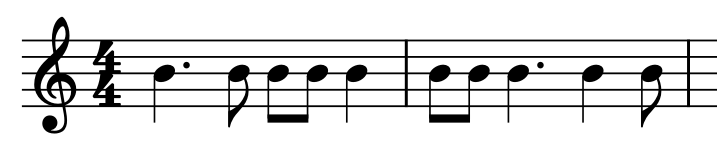
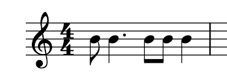
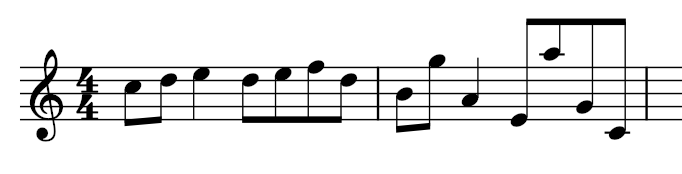
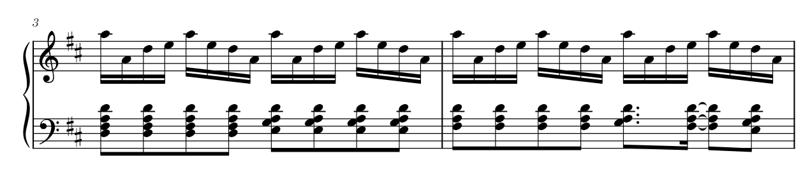
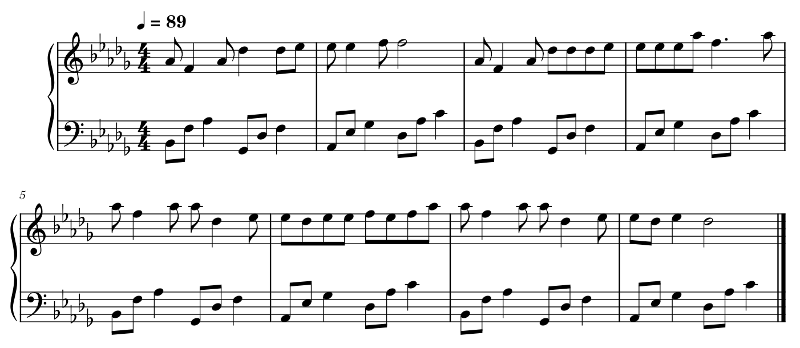

# 2023秋音乐与数学期中大作业

## 作业要求

本次作业要求利用 **遗传算法(Genetic Algorithm)** 来进行机器作曲。通过随机生成或根据现有音乐片段，建立合适的适应度函数(fitness function)指引进化，生成更好的音乐片段。

---

## 实验工具

midi 文件能更好地建立起音乐与计算机之间的联系。在 Python 语言中，对 midi 文件有较好的第三方模块支持，以下代码基于其中使用最多的 `mido` 库进行。

为此，在文件目录下打开命令行中执行

```shell
pip install -r requirements.txt
```

来安装必要的依赖。

要开始遗传算法的训练，在命令行执行

```shell
python3 ./geneticAlgorithm.py
```

所有的 midi 文件均存放于 `midi` 文件夹下。为了能更方便地预览 midi ，使用 musescore4 进行 midi 的展示。

---

## 算法设计

遗传算法模拟自然界的自然选择定律，对一个族群进行繁衍迭代，在遗传的过程中可能发生变异(mutate)、交叉(crossover)的行为，要求我们建立一个合适的适应度(fitness)函数对子代进行筛选，最终趋于适应环境。

为了便于算法的设计，我们采用先训练好节奏，随后再对于固定的节奏来生成音调进行训练。因此训练分离为 **节奏(ryhthm)** 和 **音调(pitch)** 两部分。

### 节奏部分

#### 交叉

我们采用这样的交叉方式：对于音轨A和音轨B，随机选取一个索引i,把A音轨的i小节之前与B音轨的第i小节之后直接进行拼接。特别地出于适应度的考虑我们规定这个索引i是偶数。

#### 变异

我们为节奏设计了四种变异算法：

- 交换两个音符的时值
- 把一个音符分成两个音符
- 把两个音符合并为一个音符
- 把一个小节的全部音符复制到另一个小节

#### 适应度

衡量适应度有多方面的因素，包括：

- 我们希望强拍上有音。例如对于一个4/4拍曲子，一个小节当中的第一拍和第三拍最好有音。

在这个例子当中，第一小节的一三拍都有音，而第二小节则不然，因此我们给第二小节一个负权重。
    > **适应度公式：**
    $$
    f_1 = \frac{r_1}{n}(b-2n)
    $$
    这里 $r_1$ 是权重系数，$b$ 是强拍音数量，$n$ 是小节数。

- 如果一个曲子的节奏存在呼应，那么是很好的。特别地，对于一个8小节的曲子，我们希望$A_8 = \left\{(1,3); (2,4); (4,6); (5,7)\right\}$小节是呼应的。可以简单建立一个描述两小节相似度的函数。
    > **适应度公式：**
    $$
    f_2 = \frac{r_2}{n}\sum_{i,j:\rm{Bar}} c_{i,j}=\frac{r_2}{n}\sum_{i,j:\rm{Bar}} \frac{\left| I\cap J\right|^2}{\left| I \right|\left| J \right|}
    $$
    这里 $r_2$ 是权重系数，$i,j$ 表示要比较的小节（例如对于8小节片段，数对 $(i,j)$ 遍历集合 $A_8$），而 $I, J$ 表示 $i,j$ 两小节的音符集合。两个音符相同当且仅当他们时值相同，且在小节中的相对位置相同。

- 我们希望强调强弱拍的差别，不希望出现弱拍强音。如果出现，给予相应的惩罚。

本例中的附点四分音符处于弱拍，对其给予负权值。
    > **适应度公式：**
    $$
    f_3 = -r_3\sum_{i: \rm{Bar}} \frac{b_i}{S_i}
    $$
    这里 $r_3$ 是权重系数，下标 $i$ 表示小节，$b_i$ 表示本小节中弱拍强音的个数，$S_i$ 表示本小节所有的音符个数。

- 由于我们的生成曲目很短，我们不希望存在大量的长音符。如果出现长音符，我们给予负权重。特别地，这个项目的参数可以用来调控生成曲目的节奏紧凑或者松散性。
    > **适应度公式：**
    $$
    f_4=-r_4\sum_{\alpha:\rm{Note}} p_\alpha l_\alpha
    $$
    这里 $r_4$ 是权重系数，$p_\alpha, l_\alpha$ 分别表示音符的惩罚系数和音符长度。

**最终节奏适应度定义为：**
$$
f_{\rm{rhythm}} = f_1+f_2+f_3+f_4
$$

### 音调部分

#### 交叉

由于片段太短，且交叉对音调的适应度几乎不会造成影响，因此不进行任何交叉遗传。

#### 变异

我们为音调提供了四种变异方法：

- 如果两个相邻的音相距超出一个八度，把其中一个移动八度以缩小音程差。
- 对随机一个音符进行随机的变异，改变其音调。
- 交换两个相邻的音的音调。
- 如果两个相邻而且极其接近的音相距超过纯五度，做微调使其更平滑。

#### 适应度函数

音调的适应度函数相较于节奏要复杂的多，这是因为音调旋律走向好坏受人的主观影响很大。为了更好地指导进化方向，我们准备一个现有的参考 midi 文件，它将为之后的遗传产生重要影响。关于这个 midi 的选取，我们在随后的代码实现中再详细提及。

- 比较两首片段的平均音程。在每一小节中分别计算所有相邻音符的音程，特别地计入本小节第一个音和上小节最后一个音之间的音程，构造一个函数来衡量相似度。
特别地，我们还可以给每个小节加上一个权值，用于强调小节的作用，例如第一小节赋值较大，用于强调第一小节更应与参考 midi 相似。
    > **适应度公式：**
    $$
    f_1 = p_1 \exp \left\{ -{\frac{1}{n}\sum_{i:\rm{Bar}}x_i(\mu_i-\hat \mu_i)} \right\}
    $$
    这里 $p_1$ 是权重系数，$n$ 是小节个数，$x_i$ 是小节权值，$\mu_i, \hat \mu_i$ 分别表示现有 midi 和参考 midi 的第 $i$ 小节平均音程。

- 对于相邻的三个音，我们鼓励它们音符相连或按照音阶上行下行，而反对它们中间的音明显高于或低于两侧。对这两种情形给予相应的正负权值。

本例中前一小节显然比后一小节更加理想，前者得正权值，后者得负权值。
    > **适应度公式：**
    $$
    f_2 = \frac{p_2}{n}\sum_{i: \rm{Bar}}{\left( Ss_i-Tt_i \right)}
    $$
    这里 $p_2$ 是权重系数，$S, T$ 是奖励惩罚系数，$s_i, t_i$ 是奖励惩罚三元音符组个数。

- 我们希望曲目的旋律进行色彩与参考 midi 相似。由于音乐中的强拍大致决定了整个曲子的和弦走向，我们充分考虑每一个强拍音的乐理功能，并根据不同的功能对每个音设置不同的“色彩值”，随后将其与参考 midi 相比。
    音级     | 功能    |色彩值
    :--------: | :-----: | :-----:
    I（主音）  | 稳定、终止 | 1
    III（中音）、VI（下中音） | 介稳、半终止 | 2~3
    II（上主音）、V（属音） | 不稳定、解决 | 3~4
    IV（下属音）、VII（导音）  | 极不稳定 | 4~5

    > **适应度公式：**
    $$
    f_3 = p_3 \exp \left\{ -{\frac{1}{n}\sum_{\alpha:\rm{Notes}}y_\alpha(\lambda_\alpha-\hat \lambda_\alpha)} \right\}
    $$
    这里 $p_3$ 是权重系数，$y_\alpha$ 是强拍音权值，$\lambda_\alpha, \hat \lambda_\alpha$ 分别表示现有 midi 和参考 midi 的强拍音 $\alpha$ 色彩值。

- 类似于节奏，在音调中我们也鼓励旋律反复或者（调内）平移倒影的出现。
    > **适应度公式：**
    $$
    f_4 = \frac{p_4}{n}\sum_{i,j:\rm{Bar}} g_{i,j}
    $$
    这里 $p_4$ 是权重系数，$g_{i,j}$ 是用于衡量 $i,j$ 小节音调相似度的函数。

- 我们还提出旋律线起伏的作用。旋律线的含义指的是音乐的上行与下行，我们以时间为自变量，音符音调为因变量，计算生成片段与目标片段的相关系数。
    > **适应度公式：**
    $$
    f_5 = p_5 \rho \left( A_i, \hat{A_i} \right)
    $$
    这里 $p_5$ 是权重系数，$\rho$ 表示音符序列 $A_i, B_i$ 的相关系数。

**最终音调适应度定义为：**
$$
f_{\rm{pitch}} = f_1+f_2+f_3+f_4
$$

---

## 代码实现

### 模块包装

`mido` 原本的逻辑是把 midi 文件剖分为若干音轨，每个音轨是一个列表，内部按照 **事件** 逻辑来存储音符信息。例如元事件：

```py
mido.MetaMessage("key_signature", key="C", time=0)
```

用于签订调式为C大调，而事件

```py
mido.Message("note_on", note=72, velocity=80, time=480)
```

用于声明一个音符发出的事件，距离上一个事件结束480tick(=1拍)。该音符为C5(=72)，音量为80。

由于以下的作曲非常简单，没有必要使用 `mido` 中这样复杂的功能，因此我们对 `mido` 库做出了包装，即 `midoWrapper`。其中提供了对音符的类 `Note` 包装和音轨的类 `Track` 包装。以下介绍运行逻辑和一些重要的函数。

```py
class Note:
    def __init__(
        self, pitch: Pitch_T, length: int, start_time: int, velocity: int = VELOCITY
    ):
        # Here the "time" is "tick" in mido actually
        self.pitch = pitch
        self.length = length
        self.start_time = start_time
        self.velocity = velocity
    
    @property
    def end_time(self):
        return self.start_time + self.length
```

类 `Note` 中的音符包含音高、长度、起始时间（指在音轨中的绝对时间，而非原本 `mido` 库中与上一事件的相对时间）和音量信息，同时提供查询结束时间的属性。此外，也提供了音名（例如C5）与 midi 音高编码（例如72）之间的转化接口，判断一个音是否在一个固定的调式中等等。

特别地，我们提供了一个随机生成指定调式音符的接口：

```py
def random_pitch_in_mode(
    key: Key_T, min_pitch: int = NOTE_MIN, max_pitch: int = NOTE_MAX
): ...
```

其中 `Key_T` 类型同时兼容大调和小调的调式名称（例如 `C#` 或 `Ebm`）而 `min_pitch` 和 `max_pitch` 标定了生成音符的范围。

```py
class Track:
    def __init__(self, instrument: int = 0, key: Key_T = "C"):
        self.instrument = instrument
        self.key = key
        self.note: List[Note] = []
```

类 `Track` 当中重点强调了乐器和调式的属性，同时把所有的音符置于一个列表当中。

其中提供了与 `mido` 内置的 `midiTrack` 类型的相互转化接口：

```py
def from_track(track: mido.midiTrack) -> "Track": ...
def to_track(self) -> mido.midiTrack: ...
```

同时，由于我们的节奏训练和音调训练是分离进行的，因此我们给出了两个函数，分别用于生成随机音轨和在给定节奏之上生成随机的音高：

```py
def generate_random_track(self, bar_number: int): ...
def generate_random_pitch_on_rhythm(self, track: "Track"): ...
```

尤其要强调的是，我们也实现了 **移调、倒影和逆行** 的三个变换：

```py
def transpose(self, interval): ...
def inverse(self, center): ...
def retrograde(self): ...
```

最后，我们也提供了一些简单的函数，分别用于进行 midi 文件的生成、解析、存储。

```py
def generate_midi(key: Key_T = None): ...
def parse_midi(filename: str): ...
def save_midi(s: mido.midiFile, filename: str): ...
```

### 音轨的生成与读取

具体内容详见 [测试代码](wrapperTest.py) 。

- 在 `generate_random_midi_test` 中，我们建立了一个空白的 midi 文件，并利用 `generate_random_track` 生成了一个#g小调的4小节随机音乐片段。随后将音轨进行深拷贝，再对其作逆行变换，作为第二条音轨添加进去。这样，输出了一个双音轨的音乐片段，其中两个音轨互为逆行关系。


- 在 `read_midi_test` 中，我们对一个现有的 midi 文件进行解析，并打印出基本信息。这段 midi 节选自久石让的《Summer》。可以对 `Track` 类型直接调用 `print` 函数来输出内部音符的具体信息。


    ```txt
    Key: D
    Instrument: 0
    Length: 15353
    Bar: 8
    ----------------
    Key: D
    Instrument: 0
    Length: 15347
    Bar: 8
    ```

### 参考 midi 的选取

为了便于我们的训练，参考曲目必须满足如下几个条件，以配合遗传算法的要求：

- 具有主流调性音乐的特征，绝大部分或者所有的音都属于调内。
- 节奏简单，由于训练当中最小时值为八分音符，参考曲目也以八分音符为最佳。同时由于片段较短，最好不要出现过多的长音符。
- 旋律简单，没有大量的不和谐音程或大跳。
- 和弦进行简单清晰，例如常见的 6451 或者 4566 或者 15634145 等等。

这里我们采用了一段降D大调钢琴片段《You》，可以看到很好地满足了以上的几点要求。


### 遗传算法的建立

为了加强代码的可维护性，我们建立基类，来表示音轨的各个参数和遗传算法的过程：

```py
class TrackParameterBase(metaclass=ABCMeta): ...
class TrackGABase(metaclass=ABCMeta): ...
```

在节奏和音调的训练当中，我们分别继承基类进行，在初始化轨道时就立刻计算轨道参数，便于后续直接利用，也简化了适应度函数的计算。

特别要注意的是，为了能得到合适的终止，在遗传算法的所有过程中，要保证两点原则：

1. 在节奏的训练中，不改变最后一个音是二分音符的事实
2. 在音调的训练中，不改变最后一个音是主音的事实

所有的算法过程都已经在前一部分详细解释，这里的代码实现上不再赘述。同时，我们使用 `numpy` 包来提高计算效率。

### 训练结果

如下是一段训练的结果，调式为降D大调，曲速120BPM。
由于我们的训练具有明显的和弦色彩倾向性，因此这里的伴奏直接从参考曲目的伴奏（转调）复制而来。实际播放时可以听出与和弦配合的效果是很好的。


